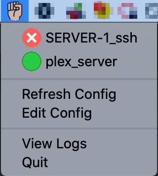

# KnockThatDoor

A port knocking utility for macOS and Windows that runs in the system tray/menu bar. This tool enables secure access to servers using the port knocking technique.



## Port Knocking Overview

Port knocking is a security method where a server's ports remain closed until it detects a specific sequence of connection attempts on predetermined ports. This technique hides services from port scanners while allowing authorized access through a specific connection pattern.

## Platform Support

- **macOS**: Runs in the menu bar with dropdown menu access
- **Windows**: Runs in the system tray with a GUI window for service management

Both platforms provide status indicators for services:
- Green: Service accessible
- Red: Service inaccessible
- Yellow: Status check in progress

## Configuration

The application uses a `conf.json` file with the following structure:

```json
{
    "services": [
      {
        "service_name": "SERVER-1_ssh",
        "ports_to_knock": ["8080:udp", "54200:tcp", "54100:udp", "80:udp"],
        "target_address": "myserver.example.com",
        "testing_address_and_port": "myserver.example.com:443",
        "delay_in_milliseconds": 300
      },
      {
        "service_name": "plex_test",
        "ports_to_knock": ["44320:udp", "6231:udp", "8080:tcp", "443:tcp"],
        "target_address": "190.190.88.88",
        "testing_address_and_port": "190.190.88.88:32400",
        "delay_in_milliseconds": 300
      }
    ]
  }
```

### Configuration Parameters

- `service_name`: Identifier displayed in the application UI
- `ports_to_knock`: Array of ports and protocols for the knock sequence
  - Format options: `"8080:tcp"`, `"8080tcp"`, or `"8080"` (defaults to TCP)
- `target_address`: Host to send the knock sequence to (IP or hostname)
- `testing_address_and_port`: Host:port to test after knock sequence
- `delay_in_milliseconds`: Delay between each knock in milliseconds

Edit the configuration through the application's "Edit Config" option and reload using "Reload Config" to apply changes.

## Usage

1. Click the application icon in system tray/menu bar
2. Select a service or click "Knock" on the service (Windows)
3. The application will execute the knock sequence
4. Status indicators show the result of the operation

## Installation

### Pre-built Binaries
1. Download from [releases page](https://github.com/rempairamore/KnockThatDoor/releases)
2. macOS: Move .app file to Applications folder
3. Windows: Extract and run the executable

### Build from Source

#### macOS Build
```bash
git clone https://github.com/your_username/KnockThatDoor.git
cd KnockThatDoor
pip install rumps py2app
python3 setup.py py2app
# Output in dist/ directory
```

#### Windows Build
```bash
git clone https://github.com/your_username/KnockThatDoor.git
cd KnockThatDoor/win64
pip install pillow pystray win10toast
python setup.py build_exe
# Output in build/ directory
```

## Troubleshooting

Use the "View Logs" option to access application logs containing detailed diagnostic information.

## License

GNU GPL v3. You may use, modify, and distribute this software, but must maintain the same license for derivatives and accept that no warranty is provided.